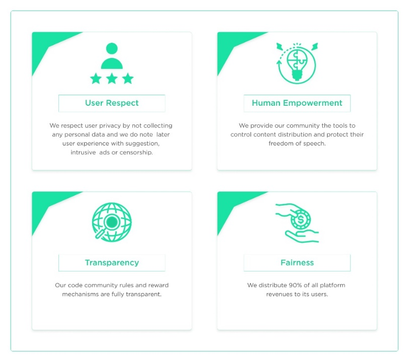

# I.1. Core Vision and Values

**A new way to conceptualize trust in social media platforms**

The social networks have completely changed how we socially interact by giving us the possibility of an online medium for it. This has created a new way to communicate with our friends or to state our opinions on sporting events, politicians or celebrities.

As content creators and users grew more accustomed to them, it became obvious that social networks were not acting in their interest, but followed certain political or commercial agendas that represented the priorities of big players. Some other apparent issues were the following:

* Privacy breaches and the distribution of user data for advertising and personal gain.
* A difficulty to moderate content without resorting to censorship.
* No incentive for content creators and low transparency over monetization algorithms and revenue sharing.

\
\

.png>)

_Figure 1_: How the platform functions

\
\

The large audiences attracted by them resulted in social networks being a means to propagate fake news and introduce a bias on how content is shared. The honesty and transparency of social networks was questioned many times and became a serious concern.

We seek to address this by creating a fair and equitable platform where moderation is conducted by the users through voting. The content that has received downvotes in a sufficient proportion can be removed and users can be rewarded for flagging it.

\
\

**The downside of a revenue model that is based on advertising**

The wide audiences of social networks allowed them to offer advertisers a solution that is cheaper, more impactful and slightly more customizable than traditional TV or newspapers. The recent trends show a limit to this approach.

To base your revenue stream just on advertising results in a series of problems. Some of them are less revenue that gets to content creators, lots of ads that contribute to a substandard viewing experience and the collection of personal data that is not liked by the community.

Our platform follows a model that respects user privacy and where moderation is conducted more efficiently and accurately by rewarding viewers to curate content and not rely on censorship. The advertisers can also be confident that their brand image is not associated with fake news or inappropriate content.

\
\

**The guiding principles**

Our team is committed to focusing on and adhering to the following principles:

* Respect for privacy: We do not collect personal data and we do not make suggestions or broadcast intrusive ads that can worsen the experience for viewers.
* User empowerment: Our community has an active role in making our platform a thriving hub by controlling content distribution and supporting freedom of speech.
* Transparency: Our code of conduct and reward structure is transparent.
* Fairness: The users are compensated for supporting the platform with 90% of revenues.

We also take special care so that our technology is influencing the environment as little as possible. The blockchain we have developed is Proof-of-Stake and has a low carbon footprint. We are aware of the environmental risks that Proof-of Work technologies pose.

The users will soon be able to vote on changes on the protocol. Some of these changes will concern social projects and allow viewers to have an active role in a positive community contribution. Our purpose is to confer social media users a better way to monetize, promote and spread their content.

#### &#x20; 

_Figure 2_: Our guiding principles.
